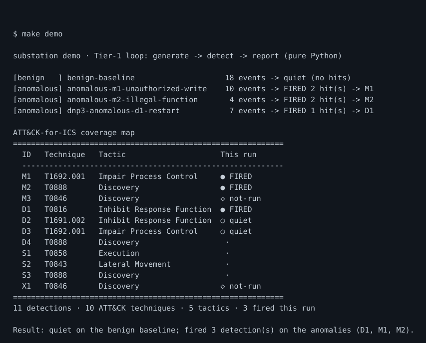
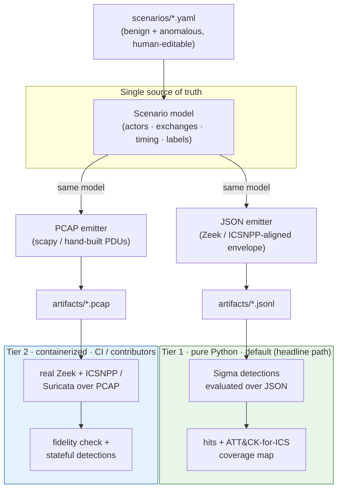

# Substation

> Clone the repo, run one command, and watch synthetic ICS telemetry flow through
> real detections and light up an ATT&CK-for-ICS coverage map — no PLC, no lab,
> no live OT.


**Substation** is a **defensive** detection-content pack for industrial-protocol
attacks and anomalies — **Modbus, DNP3, and Siemens S7** — each mapped to
**MITRE ATT&CK for ICS**, shipped with a **files-only protocol traffic simulator**
that produces benign and anomalous telemetry (PCAP **and** JSON) so the detections
can be validated **without real OT hardware**.

<!-- The badges above are intentionally STATIC. Substation's CI/CD is local and
     Claude-driven — there is no GitHub Actions and no cloud CI service to report
     a live status (see CLAUDE.md). The coverage badge reflects the
     locally-generated ATT&CK-for-ICS tactic coverage (`make coverage-build`). -->

## Why this exists

OT/ICS detection content is scarce and hard to validate: most defenders don't have
a PLC lab, so they can't generate the telemetry needed to test a rule before
trusting it in production — leaving detections untested, naive, or copied without
understanding their false-positive behavior. Substation ships **ready-to-use
detections** *and* **a safe, repeatable way to generate the telemetry that
exercises them**, together, so a rule's fire-on-attack and quiet-on-benign
behavior is proven before it ever reaches a live environment.

## Quick start

The headline path is **Python-only**: a one-line `pip install` of pure-Python
wheels (scapy, pySigma, PyYAML) — **no Zeek, no Suricata, no Docker, no hardware,
no network**. (Tier 2 below adds Docker for full-fidelity validation.)

```sh
git clone https://github.com/notacop38/substation.git
cd substation
make dev      # editable install of the pinned, pure-Python deps + dev tooling
make demo     # generate → detect → report (Tier 1, pure Python)
```

`make demo` builds synthetic Modbus telemetry from scenarios, runs the Sigma
detections over the JSON event log, and prints the hits plus the real
ATT&CK-for-ICS coverage map. It runs a **benign** baseline (which stays **quiet** —
low false positives) and **anomalous** scenarios (which **fire** real detections),
so one command shows both halves. Verbatim output:

```text
$ make demo
substation demo — Tier-1 loop: generate -> detect -> report (pure Python)

[benign   ] benign-baseline                    18 events -> quiet (no hits)
[anomalous] anomalous-m1-unauthorized-write    10 events -> FIRED 2 hit(s) -> M1
[anomalous] anomalous-m2-illegal-function       4 events -> FIRED 2 hit(s) -> M2

ATT&CK-for-ICS coverage map
============================================================
  ID   Technique   Tactic                     This run
  ----------------------------------------------------------
  M1   T1692.001   Impair Process Control     ● FIRED
  M2   T0888       Discovery                  ● FIRED
  M3   T0846       Discovery                  ○ quiet
  D1   T0816       Inhibit Response Function   ·
  D2   T1691.002   Inhibit Response Function   ·
  D3   T1692.001   Impair Process Control      ·
  D4   T0888       Discovery                   ·
  S1   T0858       Execution                   ·
  S2   T0843       Lateral Movement            ·
  S3   T0888       Discovery                   ·
  X1   T0846       Discovery                  ○ quiet
============================================================
11 detections · 10 ATT&CK techniques · 5 tactics · 2 fired this run

Result: quiet on the benign baseline; fired 2 detection(s) on the anomalies (M1, M2).
```



> The block above is the tool's **verbatim output**. The in-terminal coverage map
> is registry-driven (the same metadata behind the full generated table); the
> downloadable ATT&CK Navigator layer + full table come from `make coverage-build`
> (see [Coverage](#coverage)). The image above is a styled placeholder — record the
> real animated cast with [`make demo-cast`](#recording-the-demo).

## Architecture

One scenario model drives **both** emitters, so the PCAP and the JSON event log can
never drift. Generation is pure Python; the headline path (Tier 1) runs anywhere,
and Tier 2 validates the rest alongside it.



## Coverage

Substation maps every detection to a **verified** ATT&CK-for-ICS technique ID
(confirmed against the live matrix, never from memory). The authoritative coverage
map is **generated** from `detections/registry.yaml` by `make coverage-build` and
checked against the registry by `make ci` (`coverage-check`), so it can't drift
from the detections — see [`docs/coverage/coverage.md`](docs/coverage/coverage.md).
The table below is a hand-maintained **snapshot** of that generated map for
at-a-glance reading; if it ever disagrees with the generated file, the generated
file wins.

**Load it in the Navigator:** download
[`docs/coverage/navigator-layer.json`](docs/coverage/navigator-layer.json) and open
it in the [ATT&CK Navigator](https://mitre-attack.github.io/attack-navigator/) to
view Substation's coverage on the live ICS matrix. Full rendered map:
[`docs/coverage/coverage.md`](docs/coverage/coverage.md).

| Detection | Title | Protocol | Technique(s) | Tactic | Engine | Tier | Status |
|---|---|---|---|---|---|---|---|
| M1 | Unauthorized register/coil write | modbus | T1692.001, T0836 | Impair Process Control (TA0106) | sigma | 1 | validated |
| M2 | Illegal / abnormal function code | modbus | T0888 | Discovery (TA0102) | sigma | 1 | partial |
| M3 | Function-code / unit-ID sweep | modbus | T0846, T0888 | Discovery (TA0102) | zeek | 2 | tier2 |
| D1 | Cold/warm restart from unexpected source | dnp3 | T0816, T0814 | Inhibit Response Function (TA0107) | sigma | 1 | validated |
| D2 | Disable unsolicited responses | dnp3 | T1691.002, T0878 | Inhibit Response Function (TA0107) | sigma | 1 | validated |
| D3 | Unauthorized control (operate/direct-operate) | dnp3 | T1692.001 | Impair Process Control (TA0106) | sigma | 1 | validated |
| D4 | Function-code enumeration / scanning | dnp3 | T0888, T0846 | Discovery (TA0102) | zeek | 2 | tier2 |
| S1 | CPU stop/start from unexpected source | s7comm | T0858 | Execution (TA0104) | sigma | 1 | validated |
| S2 | Program / data-block write or download | s7comm | T0843 | Lateral Movement (TA0109) | sigma | 1 | validated |
| S3 | Enumeration / module-info reads | s7comm | T0888, T0846 | Discovery (TA0102) | zeek | 2 | tier2 |
| X1 | Cross-protocol baseline deviation (new talker / asset pair / function) | cross | T0846 | Discovery (TA0102) | zeek | 2 | tier2 |

**5 of 12** ATT&CK-for-ICS tactics currently have at least one detection
(Execution, Discovery, Lateral Movement, Inhibit Response Function, Impair Process
Control). Tactics are stable; the gaps are candidate areas for new detections, not
missing technique IDs.

## Two-tier execution

The single most important UX/credibility decision: the headline path has **zero
external dependencies**, while the harder, stateful detections are still genuinely
proven.

- **Tier 1 — Python-only, the headline path.** Generate telemetry (pure Python) →
  run **Sigma** detections over the **JSON** event log → print hits + coverage map.
  Needs **Python 3.11+** and a one-line `pip install` of pure-Python wheels — no
  Zeek, Suricata, Docker, or hardware. This is what `make demo` runs.
- **Tier 2 — full-fidelity validation (CI / contributors).** Run the generated
  **PCAPs** through real **Zeek + ICSNPP** and/or **Suricata** (containerized) to
  (a) prove our synthetic JSON matches real Zeek output and (b) execute the
  Zeek-script and Suricata detections that genuinely require packet-level state
  (e.g. the sweep detections and the cross-protocol baseline X1). Run with
  `make verify`.

Sigma-over-JSON detections need no Zeek; Zeek/Suricata detections inherently
require their engine and are therefore validated in Tier 2. This keeps the barrier
to first success near zero while still proving the harder rails.

## Safety

Substation is **strictly defensive**. These are non-negotiable invariants, stated
here and enforced in code and tests.

- **Files-only simulator.** The simulator only ever **writes files** (PCAP/JSON).
  It **never** opens a sending socket and **never** transmits on a live network
  interface. This is guarded in code (`substation/emit/guard.py` makes every socket
  connect/transmit primitive raise during emission) and asserted in tests
  (`tests/test_files_only.py`).
- **Defensive-only.** We model the *network signature* of malicious behavior so it
  can be **detected**. There is **no exploit code, no weaponization, and no
  payloads** intended to manipulate or damage real equipment.
- **Passive, isolated honeypot (if ever built).** Any honeypot is opt-in,
  network-isolated, research-only, and the last priority — never part of the
  headline path.

Substation is **not** a SIEM, a packet-capture appliance, or a substitute for a
real OT monitoring product.

## Recording the demo

`make demo-cast` records the one-command demo with
[asciinema](https://asciinema.org/) and renders it to the embedded animated
**SVG** with [svg-term-cli](https://github.com/marionebl/svg-term-cli), writing
`docs/assets/demo.svg`. An optional **GIF** can additionally be rendered with
[agg](https://github.com/asciinema/agg) via `RENDER_GIF=1 make demo-cast` (agg
emits GIF, not SVG, which is why the SVG path uses svg-term):

```sh
make demo-cast
```

This needs a TTY to drive the recording, so it can't run inside a non-interactive
CI/agent environment — run it locally. The target and helper script
([`scripts/record-demo.sh`](scripts/record-demo.sh)) are scaffolded and ready; see
that script's header for the one-time `asciinema` + `agg` install steps. Until a
cast is recorded, `docs/assets/demo.svg` is a placeholder.

## Project status & docs

Substation is in active, phased development (`Modbus → DNP3 → S7 → coverage polish`).
The source of truth lives in:

- [`PRD.md`](PRD.md) — product requirements and locked decisions.
- [`ENGINEERING_CHECKLIST.md`](ENGINEERING_CHECKLIST.md) — phased build plan.
- [`CLAUDE.md`](CLAUDE.md) — the project constitution and safety invariants.
- [`docs/schema.md`](docs/schema.md) — the event-log JSON schema (the binding contract).
- [`docs/scenario-format.md`](docs/scenario-format.md) — the scenario YAML format.
- [`CONTRIBUTING.md`](CONTRIBUTING.md) — how to add a protocol or a detection
  ([`docs/adding-a-protocol.md`](docs/adding-a-protocol.md),
  [`docs/adding-a-detection.md`](docs/adding-a-detection.md)).

### CI/CD is local — no cloud CI

There is **no GitHub Actions and no `.github/workflows/`**. `make ci` is the gate
(format-check, lint, type-check, tests, schema validation, coverage check), and the
git pre-push hook (`make hooks`) runs it before every push.

## License

[MIT](LICENSE).
