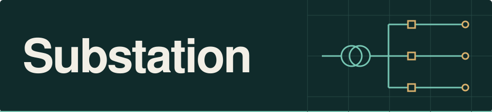
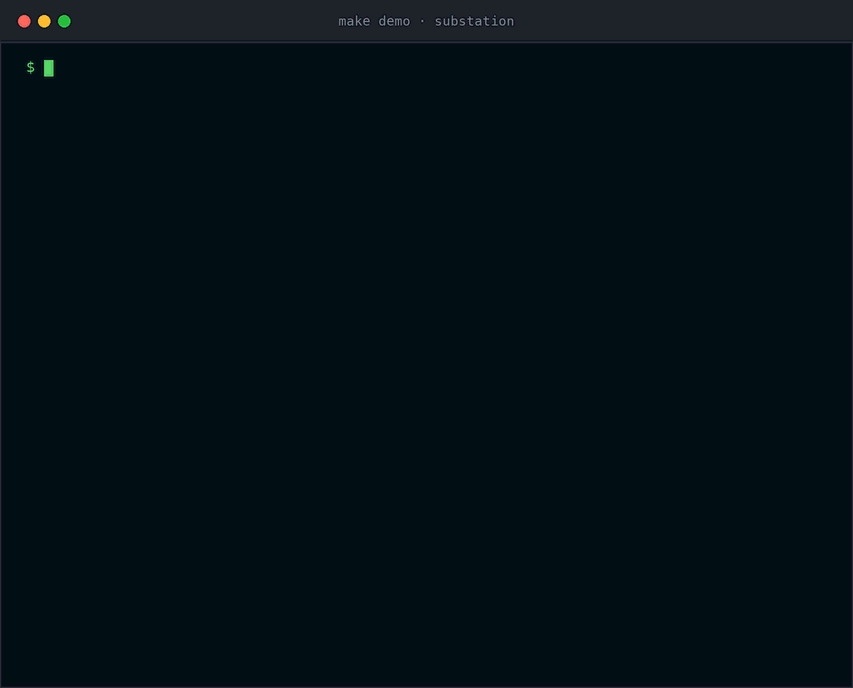
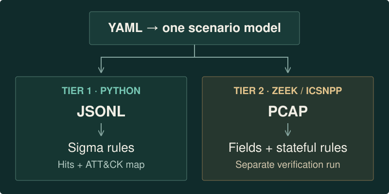
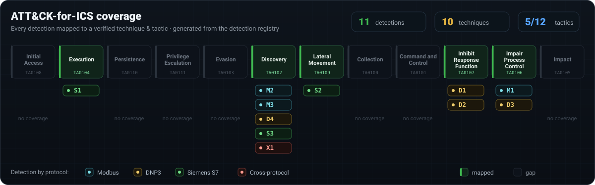
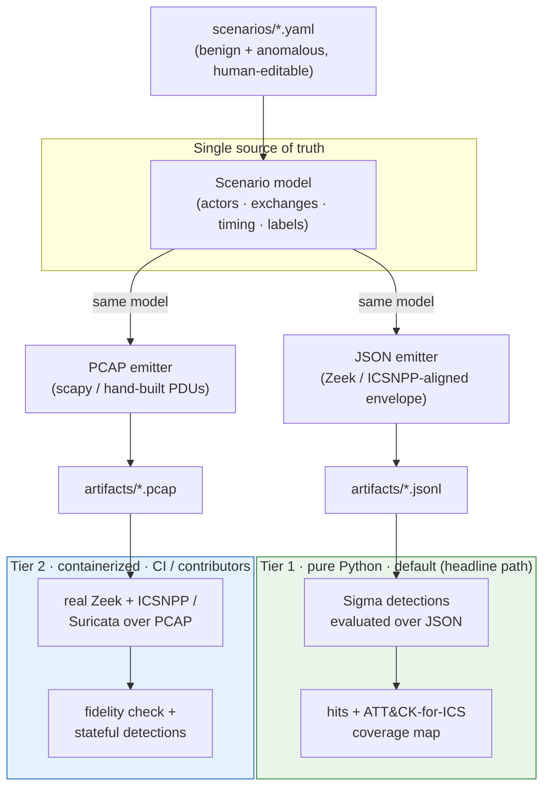

<!-- ============================== HERO ============================== -->
<div align="center">



<br/>

### Clone the repo, run **one command**, and watch synthetic ICS telemetry flow through *real* detections and light up an ATT&CK-for-ICS coverage map. **No PLC, no lab, no live OT.**

<br/>

[](LICENSE)
[](pyproject.toml)
[](CHANGELOG.md)
[](CLAUDE.md)
<br/>
[](https://attack.mitre.org/matrices/ics/)
[](#safety)
[](#two-tier-execution)

<!-- The badges above are intentionally STATIC. Substation's CI/CD is local and
     Claude-driven; there is no GitHub Actions and no cloud CI service to report a
     live status (see CLAUDE.md). The coverage figures reflect the locally-generated
     ATT&CK-for-ICS map (`make coverage-build`). -->

**[Quick start](#quick-start) · [How it works](#how-it-works) · [Coverage](#coverage) · [Two-tier execution](#two-tier-execution) · [Safety](#safety) · [Docs](#docs-and-status)**

</div>

---

## Why this exists

OT/ICS detection content is scarce and hard to validate: most defenders don't have
a PLC lab, so they can't generate the telemetry needed to test a rule before
trusting it in production, leaving detections untested, naive, or copied without
understanding their false-positive behavior. **Substation ships ready-to-use
detections *and* a safe, repeatable way to generate the telemetry that exercises
them, together**, so a rule's fire-on-attack and quiet-on-benign behavior is proven
before it ever reaches a live environment.

| | |
|---|---|
| 🛡️ **Defensive detection pack** | Modbus · DNP3 · Siemens S7, every rule mapped to a **verified** ATT&CK-for-ICS technique |
| 📡 **Files-only simulator** | one scenario model → **dual emit** (PCAP **and** JSON), so telemetry can't drift from the rules |
| 🧪 **Proven, not promised** | every detection ships with fire-on-anomaly and quiet-on-benign scenarios; the catalogue states which engine/tier validates each rule |
| ⚡ **One command, < 5 min** | pure-Python headline path: no Zeek, no Suricata, no Docker, no hardware |

## Quick start

The headline path is **Python-only**: a one-line `pip install` of pure-Python
wheels (scapy, pySigma, PyYAML): **no Zeek, no Suricata, no Docker, no hardware,
and no live OT network traffic**. First install may download wheels; the simulator
itself only writes files. (Tier 2 below adds Docker for full-fidelity validation.)

```sh
git clone https://github.com/notacop38/substation.git
cd substation
make dev      # editable install of the pinned, pure-Python deps + dev tooling (Python 3.11+)
make demo     # generate → detect → report (Tier 1, pure Python)
```

`make demo` builds synthetic Modbus telemetry from scenarios, runs the Sigma
detections over the JSON event log, and prints the hits plus the real
ATT&CK-for-ICS coverage map. It runs a **benign** baseline (which stays **quiet**,
keeping false positives low) and **anomalous** scenarios (which **fire** real detections),
so one command shows both halves:

<div align="center">
  
</div>

<details>
<summary>📄 Same output as copy-pasteable text</summary>

```text
$ make demo
substation demo · Tier-1 loop: generate -> detect -> report (pure Python)

[benign   ] modbus-benign-baseline                 18 events -> quiet (no hits)
[anomalous] modbus-anomalous-m1-unauthorized-write 10 events -> FIRED 2 hit(s) -> M1
[anomalous] modbus-anomalous-m2-illegal-function    4 events -> FIRED 2 hit(s) -> M2

ATT&CK-for-ICS coverage map
============================================================
  ID   Technique   Tactic                     This run
  ----------------------------------------------------------
  M1   T1692.001   Impair Process Control     ● FIRED
  M2   T0888       Discovery                  ● FIRED
  M3   T0846       Discovery                  ○ quiet
  D1   T0816       Inhibit Response Function   ·
  D2   T1691.002   Inhibit Response Function   ·
  D3   T1692.001   Impair Process Control      ·
  D4   T0888       Discovery                   ·
  S1   T0858       Execution                   ·
  S2   T0843       Lateral Movement            ·
  S3   T0888       Discovery                   ·
  X1   T0846       Discovery                  ○ quiet
============================================================
11 detections · 10 ATT&CK techniques · 5 tactics · 2 fired this run

Result: quiet on the benign baseline; fired 2 detection(s) on the anomalies (M1, M2).
```

</details>

> The animation above is the tool's **verbatim output**, rendered faithfully and
> regenerated headlessly by [`make demo-gif`](#recording-the-demo). The in-terminal
> coverage map is registry-driven (the same metadata behind the full generated
> table); the downloadable ATT&CK Navigator layer + full table come from
> `make coverage-build` (see [Coverage](#coverage)).

## How it works

<div align="center">
  
</div>

One **scenario model** is the single source of truth for a run. It feeds **both**
emitters, so the PCAP and the JSON event log can never disagree:

1. **Generate:** load human-editable `scenarios/*.yaml` → build the scenario model
   → emit a `.pcap` *and* a Zeek/ICSNPP-aligned `.jsonl` event log from that one model.
2. **Detect:** evaluate **Sigma** rules directly over the JSON (Tier 1, pure Python),
   and run **Zeek** over the PCAP for the stateful rules (Tier 2).
3. **Report:** print the hits and the ATT&CK-for-ICS coverage map: detections
   **fire on attacks** and stay **quiet on benign** traffic.

See [Architecture](#architecture) for the full diagram, and
[Two-tier execution](#two-tier-execution) for the Tier 1 / Tier 2 split.

## Coverage

Every detection maps to a **verified** ATT&CK-for-ICS technique ID (confirmed
against the live matrix, never from memory). The authoritative coverage map,
[`docs/coverage/`](docs/coverage/) (table, JSON, and Navigator layer), is
**generated** from [`detections/registry.yaml`](detections/registry.yaml) by
`make coverage-build` and drift-checked by `make ci`, so it can't diverge from the
detections. The graphic and catalogue below are visual snapshots of that generated map:

<div align="center">
  
</div>

> **Load it in the Navigator:** download
> [`docs/coverage/navigator-layer.json`](docs/coverage/navigator-layer.json) and open
> it in the [ATT&CK Navigator](https://mitre-attack.github.io/attack-navigator/) to
> view Substation's coverage on the live ICS matrix. Full rendered map:
> [`docs/coverage/coverage.md`](docs/coverage/coverage.md).

<details open>
<summary><b>Detection catalogue</b>: 11 detections · 3 protocols · 2 engines</summary>

<br/>

| Detection | Title | Protocol | Technique(s) | Tactic | Engine | Tier | Status |
|---|---|---|---|---|---|---|---|
| **M1** | Unauthorized register/coil write | `modbus` | T1692.001, T0836 | Impair Process Control (TA0106) | sigma | 1 | ✅ validated |
| **M2** | Illegal / abnormal function code | `modbus` | T0888 | Discovery (TA0102) | sigma | 1 | ✅ validated |
| **M3** | Function-code / unit-ID sweep | `modbus` | T0846, T0888 | Discovery (TA0102) | zeek | 2 | 🔵 tier 2 |
| **D1** | Cold/warm restart from unexpected source | `dnp3` | T0816, T0814 | Inhibit Response Function (TA0107) | sigma | 1 | ✅ validated |
| **D2** | Disable unsolicited responses | `dnp3` | T1691.002, T0878 | Inhibit Response Function (TA0107) | sigma | 1 | ✅ validated |
| **D3** | Unauthorized control (operate/direct-operate) | `dnp3` | T1692.001 | Impair Process Control (TA0106) | sigma | 1 | ✅ validated |
| **D4** | Function-code enumeration / scanning | `dnp3` | T0888, T0846 | Discovery (TA0102) | zeek | 2 | 🔵 tier 2 |
| **S1** | CPU stop/start from unexpected source | `s7comm` | T0858 | Execution (TA0104) | sigma | 1 | ✅ validated |
| **S2** | Program / data-block write or download | `s7comm` | T0843 | Lateral Movement (TA0109) | sigma | 1 | ✅ validated |
| **S3** | Enumeration / module-info reads | `s7comm` | T0888, T0846 | Discovery (TA0102) | zeek | 2 | 🔵 tier 2 |
| **X1** | Cross-protocol baseline deviation (new talker / asset pair / function) | `cross` | T0846 | Discovery (TA0102) | zeek | 2 | 🔵 tier 2 |

</details>

**5 of 12** ATT&CK-for-ICS tactics currently have at least one detection (Execution,
Discovery, Lateral Movement, Inhibit Response Function, Impair Process Control).
Tactics are stable; the gaps are candidate areas for new detections, not missing
technique IDs.

## Architecture

One scenario model drives **both** emitters, so the PCAP and the JSON event log can
never drift. Generation is pure Python; the headline path (Tier 1) runs anywhere,
and Tier 2 validates the rest alongside it.



## Two-tier execution

The single most important UX/credibility decision: the headline path has **zero
external dependencies**, while the harder, stateful detections are still genuinely
proven.

<table>
<tr>
<th width="50%">🟢 Tier 1: the headline path</th>
<th width="50%">🔵 Tier 2: full-fidelity validation</th>
</tr>
<tr>
<td valign="top">
<b>Python-only.</b> Generate telemetry (pure Python) → run <b>Sigma</b> detections over the <b>JSON</b> event log → print hits + coverage map.
<br/><br/>
Needs <b>Python&nbsp;3.11+</b> and a one-line <code>pip install</code> of pure-Python wheels, with no Zeek, Suricata, Docker, or hardware. This is what <code>make demo</code> runs.
</td>
<td valign="top">
<b>CI / contributors.</b> Run the generated <b>PCAPs</b> through real <b>Zeek + ICSNPP</b> and/or <b>Suricata</b> (containerized) to (a) prove our synthetic JSON matches real Zeek output and (b) execute the Zeek/Suricata detections that genuinely require packet-level state (the sweeps + the cross-protocol baseline X1). Run with <code>make verify</code>.
</td>
</tr>
</table>

Sigma-over-JSON detections need no Zeek; Zeek/Suricata detections inherently require
their engine and are therefore validated in Tier 2. This keeps the barrier to first
success near zero while still proving the harder rails.

## Safety

Substation is **strictly defensive**. These are non-negotiable invariants, stated
here and enforced in code and tests.

- 🔒 **Files-only simulator.** The simulator only ever **writes files** (PCAP/JSON).
  It **never** opens a sending socket and **never** transmits on a live network
  interface. This is guarded in code (`substation/emit/guard.py` makes every socket
  connect/transmit primitive raise during emission), asserted in tests
  (`tests/test_files_only.py`), and enforced by a codebase-wide static scan
  (`tests/test_no_raw_socket_send.py`) under `make ci`.
- 🧭 **Defensive-only.** We model the *network signature* of malicious behavior so it
  can be **detected**. There is **no exploit code, no weaponization, and no payloads**
  intended to manipulate or damage real equipment.
- 🧪 **Passive, isolated honeypot (optional).** The included Modbus probe-logger is
  opt-in, binds loopback by default, network-isolated, research-only, and out of the
  headline path, never part of `make demo`.

Substation is **not** a SIEM, a packet-capture appliance, or a substitute for a real
OT monitoring product.

## Recording the demo

The terminal card under [Quick start](#quick-start) is a **faithful render** of the
real `make demo` output. It is generated two ways:

```sh
make demo-gif    # headless: deterministic animated GIF (the committed asset)
make demo-cast   # interactive: asciinema cast -> animated SVG (needs a TTY)
```

- **`make demo-gif`** runs [`scripts/render-demo-gif.py`](scripts/render-demo-gif.py),
  which replays the verbatim demo output into [`docs/assets/demo.gif`](docs/assets/demo.gif)
  with [Pillow](https://python-pillow.org/). It is deterministic and needs no TTY, so
  it reproduces the embedded asset anywhere (this is what produced the GIF above).
- **`make demo-cast`** runs [`scripts/record-demo.sh`](scripts/record-demo.sh), which
  records the live run with [asciinema](https://asciinema.org/) and renders an animated
  **SVG** via [svg-term-cli](https://github.com/marionebl/svg-term-cli) (optionally a
  GIF via [agg](https://github.com/asciinema/agg) with `RENDER_GIF=1`). asciinema needs
  an interactive TTY, so run it locally; see the script header for the one-time install
  steps.

## Docs and status

Substation reached its **v0.1.0** release across all five build phases
(`Modbus → DNP3 → S7 → cross-protocol + polish`). Every Tier-1 detection is validated
fire-**and**-quiet, and the Tier-2 runner validates the Modbus/DNP3 Zeek rails plus X1
when Docker is available. The **S7 Zeek rail (S3) and X1's S7 path** are
contract-complete, but their real-engine fire/quiet is gated on the compiled
`icsnpp-s7comm` plugin, an honest remaining gap tracked in
[`docs/launch-readiness.md`](docs/launch-readiness.md). The source of truth lives in:

- [`PRD.md`](PRD.md): product requirements and locked decisions.
- [`ENGINEERING_CHECKLIST.md`](ENGINEERING_CHECKLIST.md): phased build plan.
- [`CLAUDE.md`](CLAUDE.md): the project constitution and safety invariants.
- [`docs/schema.md`](docs/schema.md): the event-log JSON schema (the binding contract).
- [`docs/scenario-format.md`](docs/scenario-format.md): the scenario YAML format.
- [`CONTRIBUTING.md`](CONTRIBUTING.md): how to add a protocol or a detection
  ([`docs/adding-a-protocol.md`](docs/adding-a-protocol.md),
  [`docs/adding-a-detection.md`](docs/adding-a-detection.md)).

**Built on:** Python · [Sigma / pySigma](https://github.com/SigmaHQ/sigma) ·
[Zeek + ICSNPP](https://github.com/cisagov/icsnpp) ·
[Suricata](https://suricata.io/) · [scapy](https://scapy.net/) ·
[MITRE ATT&CK for ICS](https://attack.mitre.org/matrices/ics/).

### CI/CD is local (no cloud CI)

There is **no GitHub Actions and no `.github/workflows/`**. `make ci` is the gate
(format-check, lint, strict type-check, the detection harness, schema validation,
coverage-map regeneration + drift check, and the security gate), and the git pre-push
hook (`make hooks`) runs it before every push.

## License

[MIT](LICENSE).
