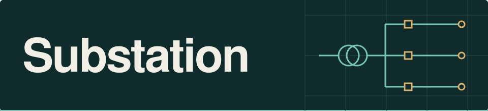
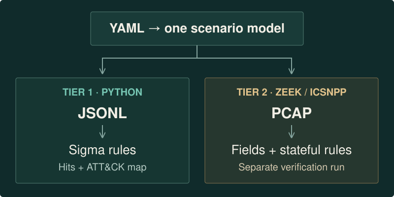
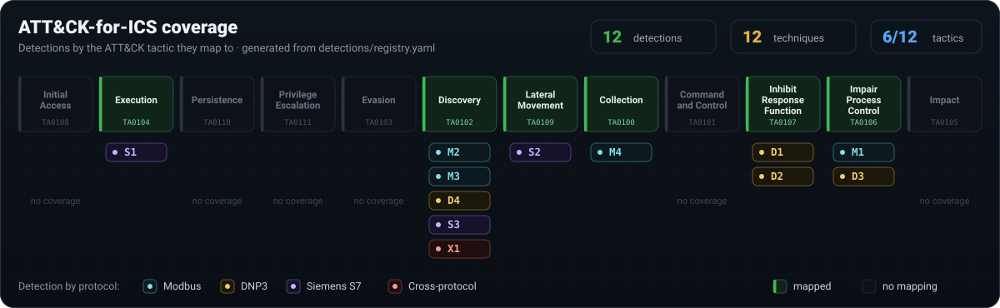

# 

**ICS detection rules you can test without a PLC lab.**

Substation is a defensive detection-content pack for **Modbus, DNP3 and Siemens
S7**. It ships twelve detections mapped to MITRE ATT&CK for ICS, each paired with
anomalous and benign traffic scenarios, and a simulator that turns each scenario
into a packet capture and a JSON event log. Every rule is tested to fire on its
attack scenario and to stay silent on the legitimate traffic around it, and real
Zeek and CISA ICSNPP parsers confirm that the generated packets decode to the
fields the event log records.

The simulator only writes files. It never opens a socket or transmits on a
network.

[Quick start](#quick-start) · [How it works](#how-it-works) ·
[Detections](#detections) · [Your own data](#run-the-rules-on-your-own-data) ·
[Validation](#validation-and-limits) · [Documentation](#documentation)

## Quick start

Requires Python 3.11, 3.12 or 3.13 on Linux or macOS. Installation downloads
Scapy, pySigma and PyYAML with their dependencies (16 packages); everything after
that runs offline.

```sh
git clone https://github.com/NotACop38/SubStation.git
cd SubStation
python3 -m venv .venv
.venv/bin/python -m pip install -e .
.venv/bin/substation demo
```

The demo generates four scenarios, runs the Sigma rules over each event log and
prints a verdict per scenario, then the ATT&CK-for-ICS coverage map
([full output](docs/demo-output.txt)):

```text
[benign   ] modbus-benign-baseline                   18 events -> quiet (no hits)
[anomalous] modbus-anomalous-m1-unauthorized-write   10 events -> FIRED 2 hit(s) -> M1
[anomalous] modbus-anomalous-m2-illegal-function      4 events -> FIRED 2 hit(s) -> M2
[anomalous] dnp3-anomalous-d1-restart                 8 events -> FIRED 1 hit(s) -> D1

Result: quiet on the benign baseline; fired 3 detection(s) on the anomalies (D1, M1, M2).
```

It exits non-zero if any scenario's expected result does not hold. Each
scenario's `.pcap` and `.jsonl` are written to `./artifacts/`; open a capture in
Wireshark beside its event log to see exactly what a rule matched.

```sh
.venv/bin/substation detect artifacts/modbus-anomalous-m1-unauthorized-write.jsonl
.venv/bin/substation list    # every detection and scenario
```

## How it works

<picture>
  <source media="(max-width: 600px)" srcset="docs/assets/pipeline-mobile.svg">
  
</picture>

A scenario is a YAML file that names the actors (HMI, engineering workstation,
PLC or outstation, attacker) and the protocol exchanges between them. One model
drives both emitters, so the capture and the event log always describe the same
traffic.

- **Tier 1 (Python).** `substation demo` and `substation detect` evaluate the
  seven Sigma rules over the JSON event log, in-process. No sensor, Docker or
  hardware is involved.
- **Tier 2 (Zeek).** `make verify` parses every capture with pinned Zeek and
  ICSNPP parsers, compares the decoded fields with the event log, and runs the
  five Zeek rules over their scenarios. It runs in Docker and builds the S7
  parser plugin on first use ([Tier-2 guide](docs/tier2.md)).

Single-event conditions are written in Sigma; behavior that needs state across
events (sweeps, enumeration, learned baselines) is written for Zeek. Each
detection's documentation records the choice and the reason.

## Detections

| ID | Detects | ATT&CK for ICS | Engine |
|---|---|---|---|
| [M1](detections/docs/M1-unauthorized-write.md) | Modbus writes outside the permitted source, PLC, unit and register span | Impair Process Control · T1692.001 | Sigma |
| [M2](detections/docs/M2-illegal-function-code.md) | Undefined Modbus function codes; illegal-function and illegal-address exceptions | Discovery · T0888 | Sigma |
| [M3](detections/docs/M3-unit-function-sweep.md) | One source sweeping Modbus function codes or unit IDs | Discovery · T0846 | Zeek |
| [M4](detections/docs/M4-read-sweep.md) | One source reading a Modbus address space page by page | Collection · T0801 | Zeek |
| [D1](detections/docs/D1-unauthorized-restart.md) | DNP3 cold or warm restart outside the approved master channel | Inhibit Response Function · T0816 | Sigma |
| [D2](detections/docs/D2-disable-unsolicited.md) | DNP3 unsolicited reporting disabled outside the approved channel | Inhibit Response Function · T1691.002 | Sigma |
| [D3](detections/docs/D3-unauthorized-operate.md) | DNP3 select, operate or direct operate outside the approved channel | Impair Process Control · T1692.001 | Sigma |
| [D4](detections/docs/D4-function-enumeration.md) | One source enumerating DNP3 function codes | Discovery · T0888 | Zeek |
| [S1](detections/docs/S1-cpu-stop-start.md) | S7 CPU stop or start outside the approved channel | Execution · T0858 | Sigma |
| [S2](detections/docs/S2-program-write-download.md) | S7 block download or block activation outside the approved channel | Lateral Movement · T0843 | Sigma |
| [S3](detections/docs/S3-enumeration.md) | One source enumerating S7 module information | Discovery · T0888 | Zeek |
| [X1](detections/docs/X1-cross-protocol-baseline.md) | A new talker, asset pair or function against a reviewed baseline, across all three protocols | Discovery · T0846 | Zeek |

The rules encode two OT realities. Engineers legitimately write setpoints and
issue controls, so the allow-list rules key on source, destination and service,
never on "any write". SCADA masters poll constantly, so the sweep rules count
distinct codes, units or address pages from one source, never request volume.



The matrix, the [coverage table](docs/coverage/coverage.md), the
[JSON report](docs/coverage/coverage.json) and the
[ATT&CK Navigator layer](docs/coverage/navigator-layer.json) are generated from
[`detections/registry.yaml`](detections/registry.yaml), and `make ci` fails if
they are stale. Every technique ID was re-checked against the live ATT&CK matrix
on 2026-09-26. A mapping states which technique the content targets, not that it
detects every instance of it.

## Run the rules on your own data

The allow-list rules ship with the demo's example addresses. Describe your site
in a versioned policy, then evaluate sensor logs against it or export the rules
as standard Sigma for your SIEM:

```sh
substation import-modbus modbus_detailed.log --out events.jsonl
substation detect events.jsonl --policy site.yaml
substation policy compile site.yaml --out site-rules
```

`import-modbus` converts CISA ICSNPP Modbus logs (Zeek JSON or TSV) into the
[event schema](docs/schema.md). DNP3 and S7 sensor import are not available yet.
The [deployment guide](docs/deployment.md) covers the policy format and the
importer's behavior on real sensor output.

To model your own traffic, write a scenario and run it with `--strict`, which
fails if a detection listed under `exercises` does not behave as declared:

```yaml
name: modbus-my-hmi-poll
protocol: modbus
label: benign
actors:
  - {id: hmi-1, role: hmi, host: 10.0.0.10}
  - {id: plc-1, role: plc, host: 10.0.0.50}
exchanges:
  - {source: hmi-1, target: plc-1, function: ReadHoldingRegisters, params: {address: 0, quantity: 10}}
exercises:
  quiet: [M1, M2]
```

```sh
.venv/bin/substation demo --scenario my-hmi-poll.yaml --strict
```

The [scenario format](docs/scenario-format.md) lists every protocol function and
parameter.

## Validation and limits

Substation is an offline regression and teaching toolkit, and every rule is
`experimental`. What its checks establish:

- **Rule behavior on its scenarios.** The Detection Contract harness requires,
  for every detection, a rule, documentation, at least one scenario it must fire
  on and one it must stay quiet on, and a verified ATT&CK mapping. Each Sigma
  rule must hit exactly the expected events, so over-matching fails.
- **Protocol fidelity.** Tier 2 shows that real Zeek and ICSNPP parsers decode
  every generated capture to the fields the event log claims, with no parser
  diagnostics, and that the Zeek rules fire and stay quiet as declared.
- **Independent evidence.** An attributed external Modbus corpus scores M1 and
  M2 per event, and the official pySigma SQLite backend reproduces the Tier-1
  evaluator's hits on the catalogue and corpus events.

What they do not establish: false-positive rates or recall on real plant
traffic, packet timing, complete protocol sessions, device behavior, or
deployment on a SIEM other than the SQLite comparison. The
[validation record](docs/validation.md) has the numbers from the latest run and
the full list of limits.

## Development

```sh
make dev                                     # hash-locked install with dev tooling
make hooks                                   # pre-push hook: runs `make ci` on the pushed commit
make ci                                      # format, lint, types, tests, schema, coverage, security
make verify VERIFY_ARGS=--require-complete   # Tier 2 in Docker
```

CI runs locally: `make ci` is the gate, enforced by the pre-push hook, and there
are no cloud CI jobs. Releases are cut locally with
`make release RELEASE_ARGS="--version X.Y.Z"`. Read
[CONTRIBUTING.md](CONTRIBUTING.md) before adding a detection or protocol.

## Safety

- **Files only.** The simulator writes PCAP and JSON and never opens a socket,
  transmits on an interface or starts a process that could. A runtime guard and
  a static scan of the package enforce this.
- **Defensive only.** Scenarios reproduce the network signature of malicious
  behavior so rules can detect it. There are no exploits, payloads or PLC
  programs. Do not replay the captures toward real equipment.
- **Passive honeypot.** The optional [Modbus honeypot](substation/honeypot/README.md)
  is separate from the simulator and the demo. It listens on loopback by default;
  an external bind requires explicit opt-ins and an isolated network.

Report vulnerabilities as described in [SECURITY.md](SECURITY.md).

## Documentation

| Document | Contents |
|---|---|
| [Design](docs/design.md) | Scope, architecture, decisions and roadmap |
| [Validation record](docs/validation.md) | What the checks establish, with numbers, and what they do not |
| [Tier 2](docs/tier2.md) | Running and interpreting `make verify` |
| [Deployment](docs/deployment.md) | Sensor import, site policies and Sigma export |
| [Event schema](docs/schema.md) | The JSONL event format rules match against |
| [Scenario format](docs/scenario-format.md) | Scenario YAML, functions and parameters |
| [Adding a detection](docs/adding-a-detection.md) · [Adding a protocol](docs/adding-a-protocol.md) | Contributor checklists |
| [Changelog](CHANGELOG.md) | Release notes |

## License

[MIT](LICENSE). Substation builds on [Sigma](https://sigmahq.io/) and
[pySigma](https://github.com/SigmaHQ/pySigma), [Zeek](https://zeek.org/) and
[CISA ICSNPP](https://github.com/cisagov/icsnpp), [Scapy](https://scapy.net/),
and [MITRE ATT&CK for ICS](https://attack.mitre.org/matrices/ics/).
